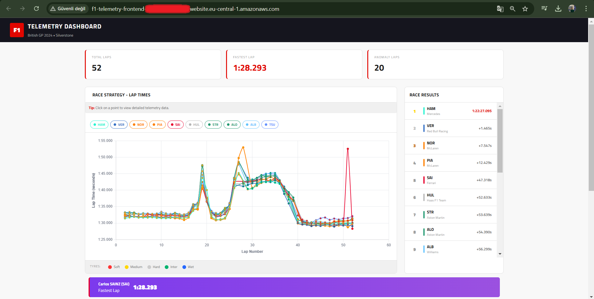
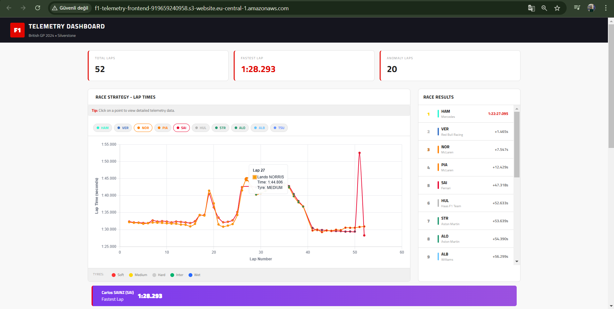
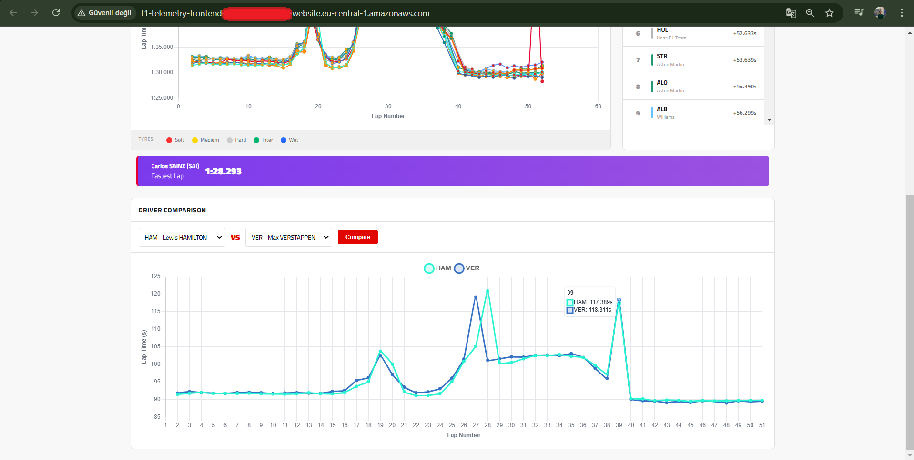
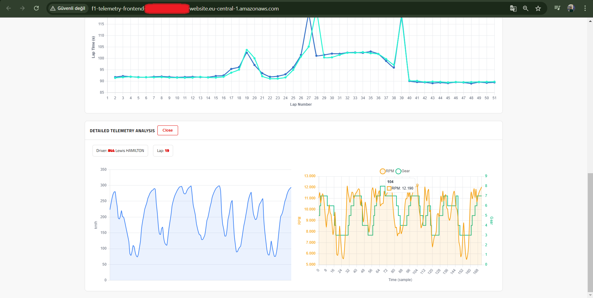

# F1 Telemetry Analysis On AWS: 2024 British GP 🏎️ 

<a name="english"></a>
## English

**A production-grade F1 analytics dashboard powered by AWS Serverless (SAM, Lambda, API Gateway) visualizing the 2024 British GP telemetry.**

> **Note:** This is an experimental project designed to gain hands-on experience with **data processing** and **cloud technologies** (AWS).

The dashboard leverages a fully serverless architecture to analyze **2024 British Grand Prix** data. It visualizes critical tire strategy shifts (Dry/Wet transitions) and provides deep-dive telemetry analysis (Speed, RPM, Gear) for race engineering enthusiasts.

### Screenshots






### Key Features

- **🏎️ Dynamic Race Strategy:** Interactive visualization of lap-by-lap tire compound evolution (Soft, Medium, Hard, Inter, Wet). Clearly displays how strategy shifts during the race, especially in changing weather conditions.
- **🧠 Statistical Anomaly Detection:** Utilizes Z-Score analysis to identify and flag unusual lap times automatically. Instantly highlights pit stops, track incidents, or significant performance drops (> 2.5 sigma deviation).
- **📉 Telemetry Drill-Down:** Provides granular data analysis for every single lap. Users can explore high-frequency vehicle metrics including Speed (km/h), RPM, and Gear shifts to understand driver performance.
- **☁️ Serverless Architecture:** Built entirely on AWS Lambda and API Gateway. This eliminates idle server costs and ensures the application automatically scales from zero to high traffic without manual intervention.

### Tech Stack

- **AWS:** SAM, Lambda, API Gateway
- **Backend:** Python
- **Frontend:** HTML, CSS, JavaScript
- **Visualization:** Chart.js
- **Data:** OpenF1 API

### Architecture

The project architecture is built entirely on a modern **Serverless** foundation, prioritizing scalability and ease of management.

- **Infrastructure as Code (IaC):** Deployed using **AWS SAM**.
- **Cost Optimization:** The Python backend uses standard libraries only (`urllib`, `statistics`, `math`) to keep the Lambda deployment package small and cold starts fast.

> **Design Philosophy:** While a simple Python script could handle this specific dataset, this project **deliberately adopts a complex, scalable serverless architecture** to demonstrate enterprise-grade cloud patterns and high-availability simulations.

### 🛠️ Quick Start

#### Prerequisites
- **AWS CLI** & **AWS SAM CLI** installed and configured.
- **Python 3.12+** installed.

#### 1. Clone & Setup
```bash
git clone https://github.com/ahmetmelihcalis/F1-Telemetry-Analysis-On-AWS.git
cd F1-Telemetry-Analysis-On-AWS
```

#### 2. Local Development (Testing)
To run the project locally without deploying to AWS:
```bash
cd backend
python local_server.py
```
The local API will start at `http://localhost:8000`. Simply open `frontend/index.html` in your browser to start.

#### 3. Deploy to AWS
To provision the Serverless architecture on your AWS account:
```bash
sam build
sam deploy --guided
```
1. Follow the interactive prompts.
2. Copy the **API Endpoint URL** from the output.
3. Update `const API_BASE` in `frontend/app.js` with this new URL.

---

<a name="türkçe"></a>
## Türkçe

**AWS Serverless (SAM, Lambda, API Gateway) ile güçlendirilmiş, 2024 Britanya GP telemetri verilerini görselleştiren profesyonel bir F1 analiz paneli.**

> **Not:** Bu çalışma, **veri işleme** ve **bulut teknolojileri** (AWS) yetkinliklerini geliştirmek amacıyla hazırlanan deneysel bir projedir.

Proje, **2024 Britanya Grand Prix** verilerini kullanarak tamamen sunucusuz (serverless) bir mimari üzerinde çalışır. Kullanıcılara lastik stratejilerini (Kuru/Islak zemin geçişleri) ve detaylı araç telemetrisini (Hız, Devir, Vites) analiz etme imkanı sunar.

### Temel Özellikler

- **🏎️ Dinamik Yarış Stratejisi:** Tur bazlı lastik hamuru değişiminin (Yumuşak, Orta, Sert, Geçiş, Yağmur) interaktif görselleştirmesi. Yarış içindeki strateji değişimlerini ve hava koşullarına tepkileri net bir şekilde gösterir.
- **🧠 İstatistiksel Anomali Tespiti:** Z-Score analizi kullanarak sıra dışı tur zamanlarını otomatik olarak tespit eder ve işaretler. Pit stopları, pist olaylarını veya ani performans düşüşlerini (> 2.5 sigma sapma) anında vurgular.
- **📉 Detaylı Telemetri Analizi:** Her bir tur için granüler veri analizi sunar. Kullanıcılar, pilot performansını anlamak için Hız (km/h), Motor Devri (RPM) ve Vites değişimleri gibi yüksek frekanslı verileri inceleyebilir.
- **☁️ Serverless Mimari:** Tamamen AWS Lambda ve API Gateway üzerine kurulmuştur. Bu yapı, boşta bekleme maliyetlerini (idle cost) ortadan kaldırır ve uygulamanın trafik arttığında otomatik olarak ölçeklenmesini sağlar.

### Kullanılan Teknolojiler

- **AWS:** SAM, Lambda, API Gateway
- **Backend:** Python
- **Frontend:** HTML, CSS, JavaScript
- **Görselleştirme:** Chart.js
- **Veri:** OpenF1 API

### Mimari

Proje, modern bulut standartlarına uygun olarak, ölçeklenebilir ve yönetimi kolay bir **Serverless** altyapı üzerine kurgulanmıştır.

- **Infrastructure as Code (IaC):** **AWS SAM** kullanılarak dağıtılmıştır.
- **Maliyet Optimizasyonu:** Python backend sadece standart kütüphaneleri (`urllib`, `statistics`, `math`) kullanır. `pandas` veya `numpy` gibi ağır kütüphaneler kullanılmamıştır, bu sayede Lambda paketi küçük kalır ve açılış (cold start) süresi hızlanır.

> **Tasarım Felsefesi:** Bu proje için **standart bir Python uygulaması** yeterli olabilecekken, kurumsal ölçekte bulut desenlerini ve yüksek erişilebilirlik senaryolarını simüle etmek amacıyla **bilinçli olarak** bu kapsamlı mimari tercih edilmiştir.

### 🛠️ Kurulum ve Hızlı Başlangıç

#### Ön Gereksinimler
- **AWS CLI** ve **AWS SAM CLI** yüklü ve yapılandırılmış olmalıdır.
- **Python 3.12+** yüklü olmalıdır.

#### 1. Projeyi İndirme
```bash
git clone https://github.com/ahmetmelihcalis/F1-Telemetry-Analysis-On-AWS.git
cd F1-Telemetry-Analysis-On-AWS
```

#### 2. Yerel Geliştirme (Local Test)
AWS'ye yüklemeden kodu bilgisayarınızda test etmek için:
```bash
cd backend
python local_server.py
```
Yerel sunucu `http://localhost:8000` adresinde çalışacaktır. `frontend/index.html` dosyasını tarayıcınızda açarak paneli kullanabilirsiniz.

#### 3. AWS'ye Dağıtım (Deploy)
API Gateway ve Lambda fonksiyonunu AWS hesabınıza kurmak için:
```bash
sam build
sam deploy --guided
```
1. Ekrana gelen soruları cevaplayın.
2. Çıktıdaki **API Endpoint URL** adresini kopyalayın.
3. `frontend/app.js` dosyasındaki `const API_BASE` değişkenini bu yeni URL ile güncelleyin.
