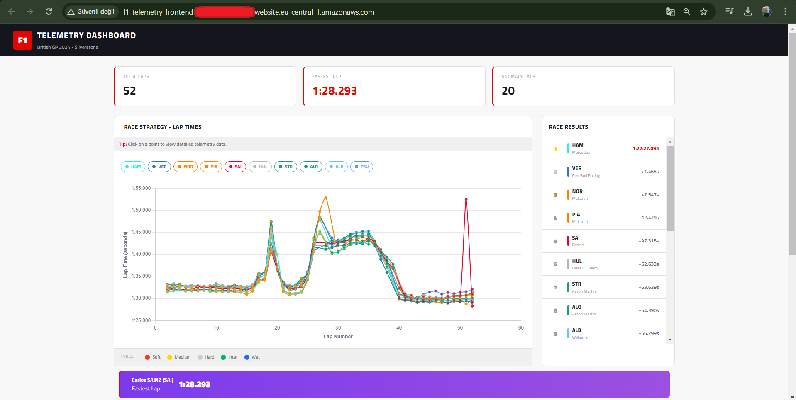
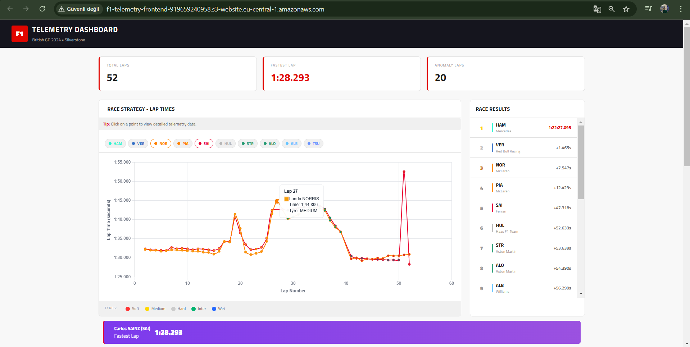
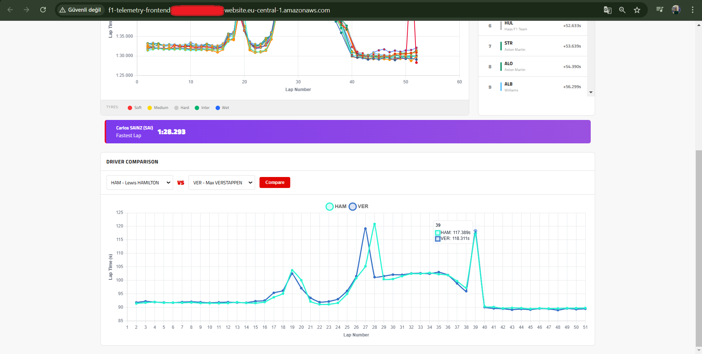
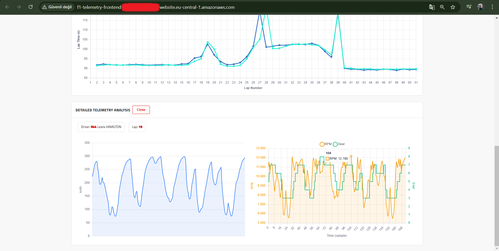
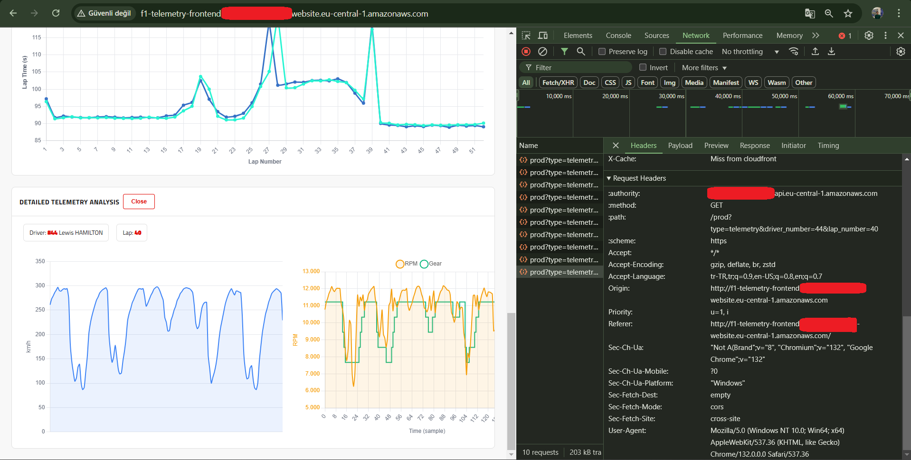

# F1 Telemetry Analysis On AWS: 2024 British GP 🏎️ 

**A production-grade F1 analytics dashboard powered by AWS Serverless (SAM, Lambda, API Gateway) visualizing the 2024 British GP telemetry.**

> **Note:** This is an experimental project designed to gain hands-on experience with **data processing** and **cloud technologies** (AWS).

The dashboard leverages a fully serverless architecture to analyze **2024 British Grand Prix** data. It visualizes critical tire strategy shifts (Dry/Wet transitions) and provides deep-dive telemetry analysis (Speed, RPM, Gear) for race engineering enthusiasts.

### Screenshots







### Key Features

- **🏎️ Dynamic Race Strategy:** Interactive visualization of lap-by-lap tire compound evolution (Soft, Medium, Hard, Inter, Wet). Clearly displays how strategy shifts during the race, especially in changing weather conditions.
- **🧠 Statistical Anomaly Detection:** Utilizes Z-Score analysis to identify and flag unusual lap times automatically. Instantly highlights pit stops, track incidents, or significant performance drops (> 2.5 sigma deviation).
- **📉 Telemetry Drill-Down:** Provides granular data analysis for every single lap. Users can explore high-frequency vehicle metrics including Speed (km/h), RPM, and Gear shifts to understand driver performance.
- **☁️ Serverless Architecture:** Built entirely on AWS Lambda and API Gateway. This eliminates idle server costs and ensures the application automatically scales from zero to high traffic without manual intervention.

### Tech Stack

- **AWS:** SAM, Lambda, API Gateway
- **Backend:** Python
- **Frontend:** HTML, CSS, JavaScript
- **Visualization:** Chart.js
- **Data:** OpenF1 API

### Architecture

The project architecture is built entirely on a modern **Serverless** foundation, prioritizing scalability and ease of management.

- **Infrastructure as Code (IaC):** Deployed using **AWS SAM**.
- **Cold Start Optimization:** Standard Python libraries (`urllib`, `statistics`, `math`) are used instead of heavier alternatives like `pandas` or `numpy` to minimize deployment package size and ensure faster Lambda execution.

> **Design Philosophy:** While a simple Python script could handle this specific dataset, this project **deliberately adopts a complex, scalable serverless architecture** to demonstrate enterprise-grade cloud patterns and high-availability simulations.

### Quick Start


#### Prerequisites
- **AWS CLI** & **AWS SAM CLI** installed and configured.
- **Python 3.12+** installed.

#### 1. Clone & Setup
```bash
git clone https://github.com/ahmetmelihcalis/F1-Telemetry-Analysis-On-AWS.git
cd F1-Telemetry-Analysis-On-AWS
```

#### 2. Local Development (Testing)
To run the project locally without deploying to AWS:
```bash
cd backend
python local_server.py
```
The local API will start at `http://localhost:8000`. Simply open `frontend/index.html` in your browser to start.

#### 3. Deploy to AWS
To provision the Serverless architecture on your AWS account:
```bash
sam build
sam deploy --guided
```
1. Follow the interactive prompts.
2. Copy the **API Endpoint URL** from the output.
3. Update `const API_BASE` in `frontend/app.js` with this new URL.
